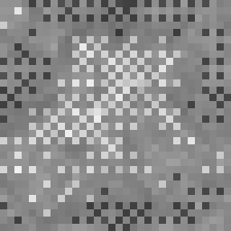

# Create: Liquid Mineral

<p align="center">
  
</p>

**[中文说明 →](README.zh.md)**

   

Adds eight molten-metal fluids — iron, gold, copper, diamond (fantasy), netherite, zinc, brass, and electrum (amber gold) — as real, pumpable, Create-compatible fluids with buckets, source/flowing blocks, and per-fluid physics, glow, and animated textures.

- **Minecraft**: 1.21.1
- **Mod loader**: NeoForge 21.1.234+
- **Required dependency**: Create 6.0.0+
- **Optional dependency**: Create: Additions & Synthetics 1.6.0+ (only needed for the electrum/amber-gold fluid — it's silently skipped if this mod isn't installed)
- **Author**: CROSS
- **License**: [GPLv3](LICENSE)
- **AI disclosure**: This mod's code, texture-generation tooling, and documentation were developed with AI pair-programming assistance (Claude Code).

---

## Table of Contents

1. [What this mod adds](#what-this-mod-adds)
2. [Installation](#installation)
3. [The fluid list](#the-fluid-list)
4. [Configuration: `fluids.json`](#configuration-fluidsjson)
5. [Adding a brand-new fluid](#adding-a-brand-new-fluid)
6. [Using your own textures](#using-your-own-textures)
7. [Generating textures](#generating-textures)
8. [Known limitations](#known-limitations)
9. [FAQ](#faq)
10. [License](#license)

---

## What this mod adds

Each fluid behaves like a real Minecraft fluid: it can be scooped into a bucket, poured out, and pumped/piped with Create's fluid machinery. Every fluid has its own:

- **Physics** — `"lava"` or `"water"` presets (weight, glow, swim/drown/hydrate/extinguish, spread speed, bucket sounds), or `"custom"` to set every one of those fields yourself in the config
- **Color** — either a baked-in procedural texture with its own hue, or a tint applied over a shared texture
- **Density / viscosity / temperature** — cosmetic/gameplay stats used by physics and (if you use them) other mods that read fluid properties
- **Light level** — how much light the fluid emits (0–15)
- **Burn behavior** — whether it damages/ignites entities that touch it
- **Family protection** — whether entities that are normally immune to lava-like damage are also immune to this fluid

## Installation

1. Install NeoForge 21.1.234 or later for Minecraft 1.21.1.
2. Install **Create** 6.0.0 or later (required — the mod won't load without it).
3. *(Optional)* Install **Create: Additions & Synthetics** 1.6.0+ if you want the electrum/molten amber-gold fluid. Without it, that one fluid is simply skipped; everything else works normally.
4. Drop `createliquidmineral-<version>.jar` into your `mods` folder.
5. Launch the game once — this generates the default config at `config/createliquidmineral/fluids.json` (see below).

## The fluid list

| Fluid ID | Display name | Physics | Requires |
|---|---|---|---|
| `molten_iron` | Molten Iron | lava-like | — |
| `molten_gold` | Molten Gold | lava-like | — |
| `molten_copper` | Molten Copper | lava-like | — |
| `molten_diamond` | Molten Diamond | lava-like | — |
| `molten_netherite` | Molten Netherite | lava-like | — |
| `molten_zinc` | Molten Zinc | lava-like | — |
| `molten_brass` | Molten Brass | lava-like | — |
| `molten_amber_gold` | Molten Amber Gold (Electrum) | lava-like | Create: Additions & Synthetics |

> Molten Diamond isn't a real-world material — diamond doesn't melt under normal conditions — so it's treated as a fantasy/crystal-liquid fluid with a distinct look (coarser color patches, the strongest specular highlight of the set, and a partial-alpha channel baked into its texture — set `"translucent": true` on it to actually render that as see-through, see [Known limitations](#known-limitations)).

All eight fluids' exact stats (density, viscosity, temperature, light level, etc.) live in the config file below and can be freely retuned without touching any code.

## Configuration: `fluids.json`

Location: `config/createliquidmineral/fluids.json` (created automatically on first launch, seeded with the mod's built-in defaults — always a valid, example-filled file, never empty).

Each entry in the JSON array is one fluid:

```json
{
  "id": "molten_iron",
  "enabled": true,
  "texture": "generated",
  "physics": "lava",
  "tint": null,
  "density": 7000,
  "viscosity": 6000,
  "temperature": 1800,
  "lightLevel": 15,
  "tickRate": null,
  "slopeFindDistance": null,
  "levelDecreasePerBlock": null,
  "canSwim": null,
  "canDrown": null,
  "canConvertToSource": null,
  "canHydrate": null,
  "canExtinguish": null,
  "burnsEntities": true,
  "protectsFamily": true,
  "requiredMod": null,
  "translucent": false
}
```

| Field | Type | Meaning |
|---|---|---|
| `id` | string, required | The fluid's registry name (also used to derive the bucket item, block, and default texture file names) |
| `enabled` | boolean or `null` | `false` = this fluid isn't registered at all — no fluid, no block, no bucket, no creative-tab entry, as if the entry didn't exist. `true`/`null`/omitted = registers normally. Checked *before* `requiredMod` — an entry with `"enabled": false` stays off even if every mod in its `requiredMod` list is installed. |
| `texture` | string | One of `"lava"`, `"generated"`, `"default"`, `"water"`. Missing/unrecognized → falls back to `"default"`. See below. |
| `physics` | string | `"lava"` or `"water"` preset, or `"custom"` to start from a neutral baseline and rely entirely on the fields below. Missing/unrecognized → `"water"`. See [Physics presets vs. `"custom"`](#physics-presets-vs-custom). |
| `tint` | hex string or `null` | Recolors the fluid's texture, e.g. `"#FF5A1F"`. Works cleanly on the `"water"` texture; on `"lava"` it'll skew warm since that texture is already orange. Leave `null` if the texture is already pre-colored (all the built-in `"generated"` textures are). |
| `density` | integer or `null` | Fluid density; `null` keeps the physics preset's value |
| `viscosity` | integer or `null` | Fluid viscosity; `null` keeps the physics preset's value |
| `temperature` | integer or `null` | Fluid temperature; `null` keeps the physics preset's value |
| `lightLevel` | integer 0–15 or `null` | How much light the fluid emits; `null` keeps the physics preset's value |
| `tickRate` | integer or `null` | How often (in ticks) the fluid spreads — lower is faster. Vanilla water is 5, lava 30. `null` keeps the physics preset's value. |
| `slopeFindDistance` | integer or `null` | How far the fluid looks for a downward slope before spreading sideways. Vanilla water is 4, lava 2. `null` keeps the physics preset's value. |
| `levelDecreasePerBlock` | integer or `null` | How much the fluid's level drops per block spread sideways. Vanilla water is 1, lava 2. `null` keeps the physics preset's value. |
| `canSwim` / `canDrown` / `canConvertToSource` / `canHydrate` / `canExtinguish` | boolean or `null` | Individual physics behaviors (can entities swim in it, can it drown them, can flowing turn into a source, does it hydrate farmland, does it put out fire). `null` keeps the physics preset's value. |
| `burnsEntities` | boolean | `true` = damages/ignites entities like lava; `false`/omitted = harmless |
| `protectsFamily` | boolean | `true` = entities immune to lava-family damage are also immune to this fluid; `false`/omitted = this fluid has its own separate immunity family |
| `requiredMod` | string, array of strings, or `null` | A mod ID (or list of mod IDs) — at least one must be loaded for this fluid to register at all. A single string like `"createaddition"` still works exactly as before; use an array like `["create", "createaddition"]` when *any one* of several mods should be enough (OR, not AND). Leave `null`/omit for no requirement. Checked only if `enabled` isn't `false` — see `enabled` above, which always wins first. |
| `translucent` | boolean or `null` | `true` = render this fluid with alpha blending (like vanilla water) instead of fully opaque (like vanilla lava, and the default for every fluid here). Needs a texture with an actual alpha channel baked in to have any visible effect — see [Generating textures](#generating-textures)'s `--alpha` flag. `false`/`null`/omitted = opaque. |

### Physics presets vs. `"custom"`

`"physics": "lava"` and `"physics": "water"` are just starting points — every field they set (`density`, `viscosity`, `temperature`, `lightLevel`, `tickRate`, `slopeFindDistance`, `levelDecreasePerBlock`, and the five `can*` booleans) can still be overridden individually per fluid, same as before. You don't need `"custom"` just to make a slightly-heavier lava or a slightly-faster water.

`"physics": "custom"` skips the preset entirely: the fluid starts from an inert, harmless baseline (water-speed spread, no swim/drown/hydrate/extinguish, water-ish density/viscosity/temperature/light) and every field you actually set in the entry is applied on top. Anything you leave out stays at that neutral baseline — so a fully custom fluid that only sets `density` and `burnsEntities` is valid, it just won't have any other opinionated behavior. Use this when you want a fluid that's neither lava-like nor water-like — e.g. a heavy, non-swimmable-but-non-burning oil, or a fast-spreading acid that still lets entities swim.

### The `texture` field, in detail

| Value | What it uses |
|---|---|
| `"lava"` | Vanilla lava's still/flowing texture, no overlay |
| `"generated"` | This mod's own procedurally-generated animated texture at `assets/createliquidmineral/textures/block/<id>_still.png` / `_flow.png` — or your own PNGs dropped into `config/createliquidmineral/textures/block/`, see [Using your own textures](#using-your-own-textures). If neither exists, silently falls back to `"default"` (no missing-texture checkerboard) |
| `"default"` | A shared neutral grey procedural texture, used as the fallback above and available directly if you want a plain look |
| `"water"` | Vanilla water's still/flowing/overlay textures — the only texture that tints cleanly, since it starts colorless |
| *(anything else, or omitted)* | Falls back to `"default"` |

Editing values in this file and restarting the game is enough to change a fluid's stats, color, glow, and behavior — **no rebuild required**. The one thing that does need care is adding a fully new fluid ID; see the next section.

## Adding a brand-new fluid

### What editing the config alone gets you

Because the mod's registration code (fluid, fluid block, bucket item, creative-tab entry) reads this same JSON file at game startup, **adding a new entry to `fluids.json` and restarting the game is enough to make the fluid fully functional** — placeable, scoopable, pumpable, with a proper bucket icon and a readable name, all without touching Java or running any build tool.

That last part (icon + name) works because the mod ships a generated fallback resource pack: at startup it synthesizes a bucket item model and English/Chinese lang entries in memory for every fluid currently in `fluids.json`, filling in exactly what `gradlew runData` would otherwise need to bake into the jar ahead of time. It only fills gaps — if a fluid already has real, datagen'd assets (all 8 bundled fluids do), those always win.

What you'll still be missing without further steps:
- **A proper name**, if you want something nicer than the auto-generated title-cased id (e.g. `molten_titanium` → "Molten Titanium"). See below.
- **A texture**, if you used `"texture": "generated"` — you'll need to actually provide `<id>_still.png` / `<id>_flow.png`, or it'll fall back to plain grey (still a real, working texture — just not custom). See [Using your own textures](#using-your-own-textures) — you don't need Java or a resource pack for this.

### Giving it a custom display name

If you want a hand-picked name instead of the auto-generated one, either:
- Ship a resource pack with `assets/createliquidmineral/lang/en_us.json` / `zh_cn.json` overrides for `item.createliquidmineral.<id>_bucket` etc. (no Java, no Gradle, no compiling), or
- If you have the mod's source, add an entry to `MoltenFluidNames.KNOWN` and run `gradlew runData` to bake it into the mod itself.

## Using your own textures

You don't need Java, Gradle, or a resource pack to give a fluid a custom look — just drop PNGs into a config folder:

```
config/createliquidmineral/textures/block/<id>_still.png
config/createliquidmineral/textures/block/<id>_flow.png
```

`<id>` is that fluid's `id` field in `fluids.json` (e.g. `molten_iron`). This folder (with a `README.txt` explaining the same thing) is created automatically the first time you launch the game with the mod installed.

- Provide **both** `_still` and `_flow` for a given fluid.
- For an **animated** texture, also drop a matching `<file>.png.mcmeta` next to the PNG — same format any Minecraft resource pack uses, e.g. `{"animation": {"frametime": 3}}`.
- A texture placed here **overrides** that fluid's texture no matter where it would otherwise come from — the mod's own bundled art, or the plain grey fallback for a brand-new fluid you only added via `fluids.json`.
- Takes effect on the **next full game restart** (it's served as a resource pack under the hood, loaded once at startup like everything else here).

This works alongside `"texture": "generated"` in `fluids.json` — you still pick that texture mode, this just supplies (or replaces) the actual pixels for it, no rebuild required.

## Generating textures

The `"generated"` textures aren't hand-drawn — they're painted procedurally by **[FluidLoom](https://github.com/HenryCROSS/FluidLoom)**, a separate open-source Python tool. See its README for full usage, every CLI flag, and how to reproduce/regenerate the 8 bundled fluids' textures — a good starting point if you want to hand off custom textures for others to drop into their own `config/createliquidmineral/textures/` folder as described above.

## Known limitations

- **Molten Diamond's texture has alpha baked in (`alpha=0.75`) but isn't marked translucent yet.** Translucent rendering is implemented (see the `translucent` field above), but Molten Diamond's `fluids.json` entry doesn't opt into it by default, so it still renders fully opaque — set `"translucent": true` on it yourself if you want that alpha to actually show.
- **Tinting (`tint` field) only looks clean on the `"water"` texture.** Applying it over `"lava"` will skew warm/orange since that texture already has its own strong color.
- **Bucket fill/empty sounds follow the `physics` preset, not individual overrides.** `"lava"` uses lava's bucket sounds and `"water"`/`"custom"` use water's; there's no config field to pick a different sound pair per fluid.
- **Highlight/bubble texture layers are static, not animated.** They're generated once per texture (not per frame) to avoid flickering, so they don't drift with the flowing noise underneath them.

## FAQ

**Q: I edited `fluids.json` but nothing changed.**
A: Restart the game completely — the config is only read once, at startup.

**Q: My new fluid's bucket shows a missing-texture icon.**
A: That shouldn't happen — the mod auto-generates a fallback bucket model for any fluid in `fluids.json`, even brand new ones. Make sure you fully restarted the game after editing the config; if it's still broken, something else is wrong (check the log for a `GeneratedFallbackPack`-related error).

**Q: Can I use any hex color for `tint`?**
A: Yes, but it only comes out clean on `"texture": "water"`. Every other texture already has its own baked-in color.

**Q: Does this need Create installed?**
A: Yes — Create is a hard, required dependency (see `neoforge.mods.toml`). Create: Additions & Synthetics is optional and only affects the electrum fluid.

**Q: Can `requiredMod` list more than one mod?**
A: Yes — `"requiredMod": ["create", "createaddition"]` registers the fluid as soon as *either* mod is present, not both. Still works as a single plain string too, e.g. `"requiredMod": "createaddition"`, for the common case of just one dependency.

**Q: How do I turn off one of the fluids without removing its config entry?**
A: Set `"enabled": false` on that entry in `fluids.json` and restart. It won't be registered at all — same as if you'd deleted the entry — but the rest of its settings stay saved in the file in case you want it back later.

**Q: I dropped my PNGs in `config/createliquidmineral/textures/block/` but the fluid still looks unchanged.**
A: Restart the game completely, and double-check the file names match exactly — `<id>_still.png` and `<id>_flow.png`, `<id>` being that fluid's `id` in `fluids.json` (lowercase, matches exactly). Provide both files: the mod only checks whether `_still.png` exists to decide "does this fluid have a real texture", so a missing `_flow.png` won't stop the still texture from applying, but the fluid will show a missing-texture checkerboard while flowing.

## License

[GNU General Public License v3.0](LICENSE) (GPL-3.0-only). You're free to use, study, modify, and redistribute this mod (including modified versions), as long as derivative works stay under the same license and keep their source available. See the [LICENSE](LICENSE) file for the full text.
